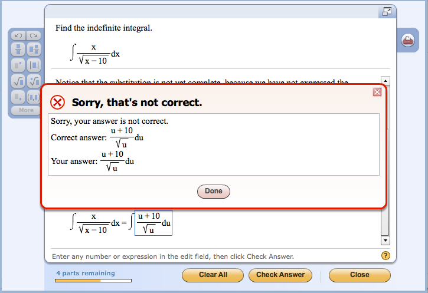

## Keeping Things Constant

*"Oh this is awkward"*

In most cases, I've noticed that pretty much everyone will write things differently than other people, even when it's writing two programs that do the same thing the same way. It can really suck when you're looking at something and come across a problem that, after much too long of a debate, is found to be just a simple mix up of variables or basic conventions. It's quite hard to make people maintain a similar way of writing things when they're working on a project together but it's an issue of the utmost importance.

One kind of coding standard is ESLint. For me, using ESLint with IntelliJ has been a trip compared to my previous experience in Ecllipse. It's quite a bit more difficult and involved to start a new project in IntelliJ, having to import files and use the terminal is quite an ordeal. Granted, it does make it really satisfying to create a project when things go right, but figuring out how to get things to go right was a huge struggle in the first place. Between that and the increased number of steps just add in more chances to make a mistake. Despite that, code standards aren't hard to follow. They're straightforward and tell you exactly what you need to change to abide by the rules. With that in mind, it's still on the programmer to make sure that the code they write does exactly what they want it to do.

## Good Code Standards Aren't a Cure-All

Learning what ESLint demands for formatting isn't too hard but keeping track of that in tandem with being a beginner at Javascript is a challenge. Good code style helps but doesn't do everything for you. Template literals were one of those challenges which showed me that even if you can follow a code style to the (Mr.) T, it doesn't mean that it'll save you from all of your problems. I had to learn the hard way that you need to use the tilde key's quote and not the single quote by the enter key in order to use template literals. I put in what I assumed to be the solution and not getting the right results frustrated me but having good code standards helped make things clear (after a while). ESLint doesn't show you that you're not using the right quotes but it does eliminate a lot of other possibilites as to what the problems could be.

## But It's A Start
*"Dude, sucking at sumthin' is the first step towards being sorta good at something." - Jake the Dog*

Not having background knowledge about how the software that you use to write code works can make it hard to use proper coding standards, or seem intimidating to get them set up, but that's all the more reason why it's important to do so. If it seems scary or way out of your league, try to remember that getting things set up properly will help you learn how things work and show you that it's not as hard to do as you first thought. All it takes is some time and patience and following the steps for set up one by one. Eventually it gets a lot easier and becomes second nature.

