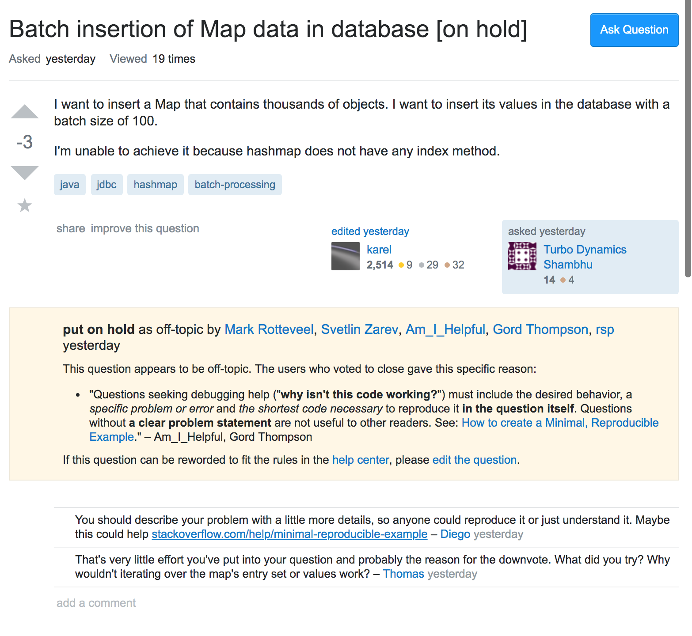
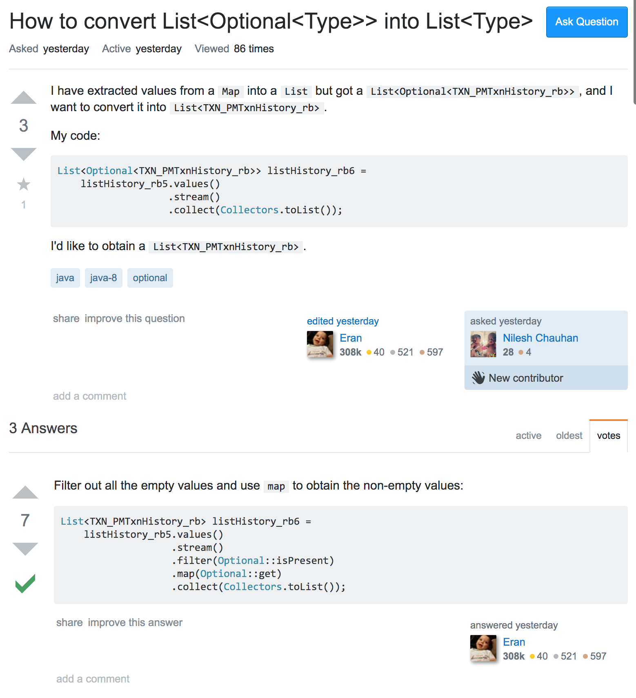

##Problems Come With Questions

The main job of a software engineer is to problem solve. Regardless of what language a software engineer programs in, you need to be able to deal with bugs when they pop up and with complicated systems that need fixing. Typically your problems can be solved on your own, with either some short debugging or simply by rereading code, but there are times when you just come to the end of your patience and simply get stumped. That's when you start asking for help from others! Unfortunatly, asking for help from other software developers poses new problems on it's own. Usually being a software developer means you're busy, and if you're looking for help from another software developer it usually means that they're taking time out of their busy day to stop and help you out.

Time is money. People won't spend their time sifting through the word puke that is your problem just to find out what the problem is. The kind of people who do software engineering and are good enough at it that they can answer the problems of others, don't want to waste their time. That means that you need to be short, sweet, to the point and polite when asking others for help. Unfortunately when people reach the point of frustration where they go to seek help, they sometimes have a hard time staying logical and not getting emotional. 

## Remember to Give your Questions A K.I.S.S.

Asking your question without stopping to think or write it clearly typically ends with a decent lack of answers or sometimes mean replies. Have you ever taken an exam but found a question that didn't have enough information provided to solve the problem? If you have then that's exactly what it's like to the people you want help from. For instance, asking about 
It's important to make sure that you "keep it simple, stupid", or give it a kiss before you ask. You also don't want to make it too simple because then you might not be able to get a detailed enough answer to your question.

For instance, Stack Overflow is a good resource to ask programming questions on but when you don't provide enough details you won't get any answers. One user was asking for help with batch inserting map data into a database. They stated what they wanted to do, insert a Map with thousands of objects into a data base with batch size 100 but said they couldn't because hashmap doesn't have an index method. But that was it. They didn't provide any example code or ask if anyone had a replacement or a substitute method to use instead. As a result, a good number of users downvoted the question and even managed to get it put on hold until the question asker could edit the question to make it better. The question asker didn't seem to have spent much time on the problem and they might have looked it up but they didn't say so and it wouldn't have been worth anyones time to ask for more details. Providing a sample case or the structure of the database would have allowed others to make comments on his work or even just asking for another solution would have gotten feedback.

 
 
 ##Show Your Work
 
 A lot of answer seekers find what the look for by providing simple problems that include enough details about what they are trying to show. Another Stack Overflow user was asking for help changing his code from a List<Optional<Type>> into List<Type>. He provided a few lines of code and explained how he extracted values from a map into a list but wants to change that list from List<Optional<Type>> into List<Type>. It was a straightforward and simple question and becuase he included his code, multiple answer givers were able to show exactly what he needed to write in order to solve the problem.
  

  
  It may seem like extra work to stop and take a breath in order to formulate a precise, simple and detailed question but it's always worth it. There are even times where doing so will end up showing you what you did wrong inspire you with a better way to do what you're trying to accomplish.

