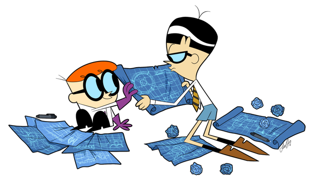

## Tools Of The Trade

As I've learned recently while developing a web application, software engineering is complicated. In order to create
 excellent software you need to build
 up an understanding of the various parts that compose it and the tools that you'll need to shape those parts to
  work most efficently together. The two tools that stood out the most during my development were Agile Project
   Management and Testing. Having each of the pieces that need to be created
   laid out makes everything flow much
   smoother, and making sure to test each part of the project as it comes together is imperative to creating a success.

### A Seamless Blueprint

Just like constructing a building, engineering new software requires a solid blueprint that depicts all of the
 features of your software. Planning
 out what your finished product will be is the most important step in creating something, similar to how you need a good
  foundation before you can build a building. Issue Driven Project Management is a part of Agile Project Management
   that can help increase the productivity of a team by leaps and bounds if used effectively. Issue Driven Project Management works by dividing up
    the different group members tasks in a way that lets them be completed in tandem. It sounds easy, but I've
     discovered that it actually takes a decent amount of experience to implement properly. 
      
#### Like most plans, it's best make before starting the project 
      
Personally, I find it very enticing to jump right into a project and start writing code instead of taking the
 time to sit down and plan out each of the parts of the project. At first I didn't think much of planning using this
  fancy Issue Driven Project Management idea. My group and I just briefly went over what basic features we each wanted and then started on our way. As a result, my team members and I ended up having to re-write a lot of code because we were working on the same part
    of the project at the same time, or built parts of the application that couldn't function with each other. After
     realizing our project was full of mistakes, we sat
     down and wrote out which features our sofware needed implementing that could be done at the same
      time and what couldn't. Doing so allowed each group member to work at the same time which drastically sped up
       our rate of progress and lowered our frustration. 
      
This method of project management is something that I will use in all of my future software engineer projects, as well
 as in
 other fields of work. Being able to break down difficult tasks into smaller pieces allows for faster
 and more efficent work to be done as well as for multiple parts to be done at the same time (if multiple people are
  working together). It's an important skill
  for any member of a team working on a project. Whether it's used for creating an application, researching a new
   technology or many other projects, it's a skill that will make completing any task much easier.
   
### Rigorous Stress Testing

Even once a building or a structure is built, regardless of how well planned out, it has to undergo tests to make sure that it can fulfill it's job and
 not crack under pressure. In other words, when you finish the project, you're not actually done; There's testing to
  do. In fact, testing
  should happen throughout the entire duration of the project because otherwise how will you know if what you've
   made so far works?
 
 
 
 As I completed each task so diligently assigned by the newly implemented Issue Driven Project Management, I spent a
  decent amount of time checking to make sure that each new addition wouldn't break at the slightest gust of wind or
   sudden appearance of spiders. Doing so required different kinds of tests for each portion of the project. The
    tests could be catagorized in one of two ways: black box and white box tests. The first being where the tester does
     not know what the internal
     structure, design and or implementation of the item being tested is and the second where the tester does have
      that knowledge. By trying different variations of black and white box testing on each piece as it's added gave
       me both a deeper understanding of how the application worked and how things that you don't think are related
        can sometimes have more to do with each other than first thought. Many bugs and unexpected errors are found
         through testing, some of which require re-working large portions of the project or simply didn't have a
          reasonable way to solve them, which would also result in major changes needing to be made or great loss of
           functionality.
           
### The Most Important Tools

While tools with fancy names like "Agile Project Management" and "white box tests" might seem important thanks to
 their flashy-ness, the biggest lesson that I learned when developing my software engineering skills and knowlege is
  that no matter what task you need to accomplish, keeping a cool head, breaking down difficult problems and working
   on them a
   little bit every day is how to succeed.