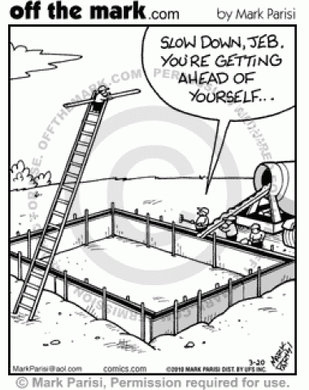

## Tools Of The Trade

Recently I've learned that software engineering is complicated. In order to create excellent software you need to build
 up an understanding of the various parts that compose it and the tools that you'll need to shape those parts to
  work most efficently together. 

### A Seamless Blueprint

Just like constructing a building, engineering software requires a solid blueprint that depicts all of the
 features of your software. Planning
 out what your finished product will be is the most important step in creating something; similar to how you need a good
  foundation before you can build a building. Issue Driven Project Management is a part of Agile Project Management
   that can help increase the productivity of a team by leaps and bounds if used effectively. Issue Driven Project
    Management
    works by dividing up
    the different tasks that need to be completed in a way that lets them be completed in tandem without the need for
     backwork to be done. It sounds easy but I've discovered that it actually takes a decent amount of work to set up
      a good plan using this method. 
      
Personally, I used to find it very entralling to simply jump right into a project and start working instead of taking
 the
 time to sit down and plan out each of the parts of the project. I had recently experienced working on a web
  application using this Issue Driven Project Management and at first we didn't do a great job of planning out what
   features we wanted in
   our project. We all just breifely went over what basic features we each wanted and then started on our way. As a
   result, my team members and I ended up having to re-write a lot of code because we were working on the same part
    of the project at the same time, or creating different features that clashed with each other. After realizing our
     project was full of mistakes, we sat
     down and wrote out which features each part of our sofware needed implemented and assigned an order to which
      features needed to be finished first. Doing so allowed us to complete
      multiple tasks at the same time, drastically reducing the time it took to finish the project. 
      
Now, you may be thinking that this method is only applicable to software engineering
 but that's where you're wrong. Have you ever made a group power point presentation before? If you have, you more
  than likely already used Issue Driven Project management. Writing out the general topics that need to be covered
   and in what order, then assigning each group member a section of slides 
   
### Rigorous Stress Testing

Even once a building or a structure is built, it has to undergo tests to make sure that it can fulfill it's job well
 without 