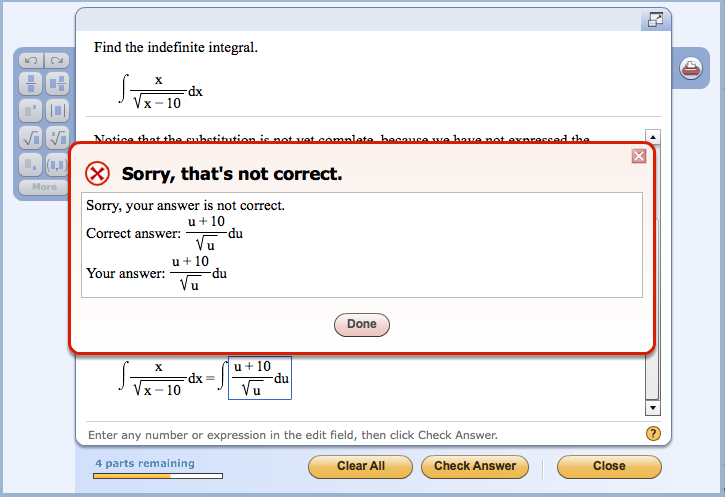

## Keeping Things Constant

*Oh this is awkward*

In most cases, I've noticed that pretty much everyone will write things fairly differently from others, even when it's writing two programs that do the same thing the same way. It can really suck when you're looking at something and come across a problem that, after much too long of a debate, is found to be just a simple mix up of variables or basic conventions. It's quite hard to make people maintain a similar way of writing things when they're working on a project together but it's an issue of the utmost importance.

Using ESLint with IntelliJ has been a trip for me versus my previous experience in ecllipse. It's quite a bit more difficult and involved to start a new project in IntelliJ, having to import files and use the terminal is quite a bother but actually makes it really satisfying to create a project when things go right. Granted, figuring out how to get things to go right was a huge struggle in the first place.

## Good Code Standards Isn't a Cure-All

Learning what ESLint demands for formatting isn't too hard but keeping track of that in tandem with being a beginner at Javascript can still be a challenge. Template literals were one of those challenges and showed me that even if you can follow a code style to the Mr. T it doesn't mean that it'll save you from all of your problems. I had to learn the hard way that you need to use the quote from the tilde key and not the single quote by the enter key in order to use template literals. Putting in what you assume to be the solution and not getting the right results is frustrating but

