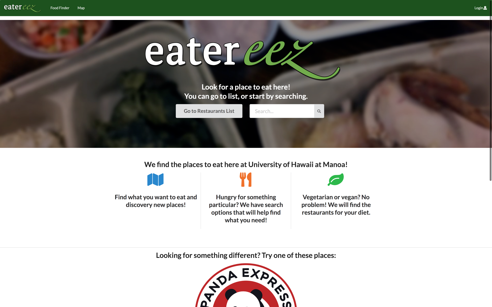
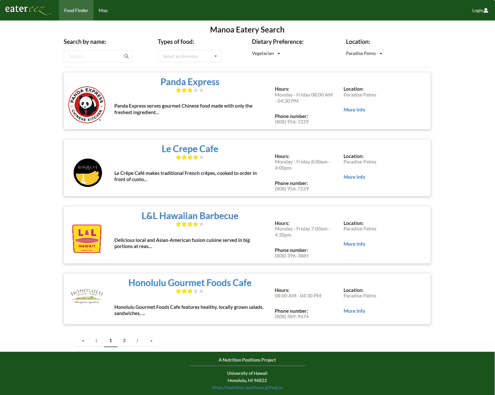
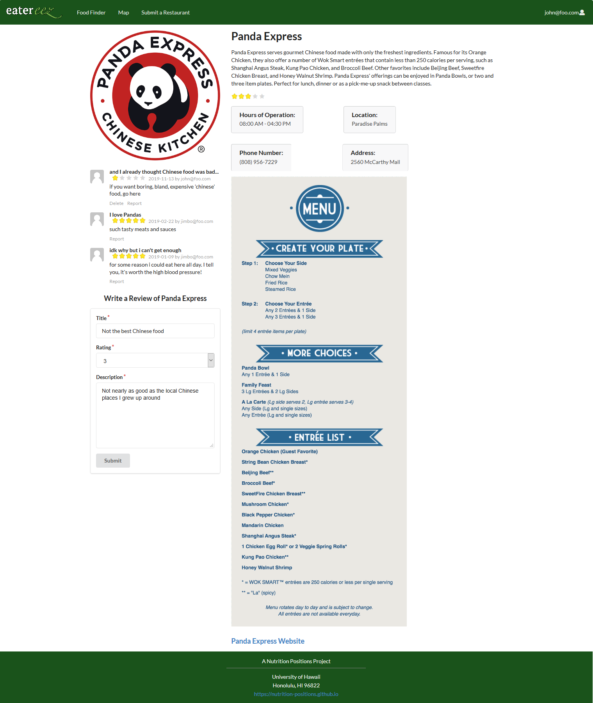

## A Better Way to Eat

UH Manoa has a plethora of choices when it comes to satisfying hunger; almost too many to keep track of for any one
 student. Eatereez provides a simple and streamlined way to discover previously unknown eateries located around campus. 
 
 The application's homepage can be accessed [here](https://nutrition-positions.github.io/)
 
 The source code can be found on Github [here](https://github.com/nutrition-positions/eatereez)
 
 
 
## Eater-Easy To Use
 
 The website lets users get right into finding information on the landing page, the page first presented when the
  application is opened (as shown above), by
  presenting them with a search bar
  at the start. From there they can look for the exact eatery they want by name, or if their search results in
   nothing, they can change the search query and look further by using the filters provided on the list of
    eateries page.
    
  

  By clicking on the name of an eatery, or the "more info" link included in the information shown, the user will be
   taken to a details page that provides a complete description of the eatery along with a menu and reviews of that
    eatery written by fellow UH Manoa students, faculty and staff.
    
  

Once logged in, users can write and report reviews, as well as submit possible new eateries. Users
 are also able to delete the reviews that they write in case they make a mistake.
 
### Admin Management
 
Site admins are able to add, edit, and remove eateries as well as reports and reported reviews. Furthermore, admins can
 also
 access user submitted eateries to include them in the viewable database.
 
### Something Special

On the landing page of the application, three random eateries are displayed which allow the user to
 discover an
 eatery which they might not previously have known existed.
 
 The map page allows users to find nearby restaurants based on their location on campus. Clicking on a pin and
  choosing "more info" takes the user to a list of eateries that can be found at the chosen location.

## Developing More Than Just the App

Throughout working on this project, I developed significantly as a software developer, team member, leader, and
 teacher. I
 had a big hand in both the front and back end development of the project; I implemented the layout of various
  pages as well as a portion of the database that we used to store and retrieve information. I created the majority of
   the admin side of the application, along with the navigation bar, footer and the page containing eatery details.
 
