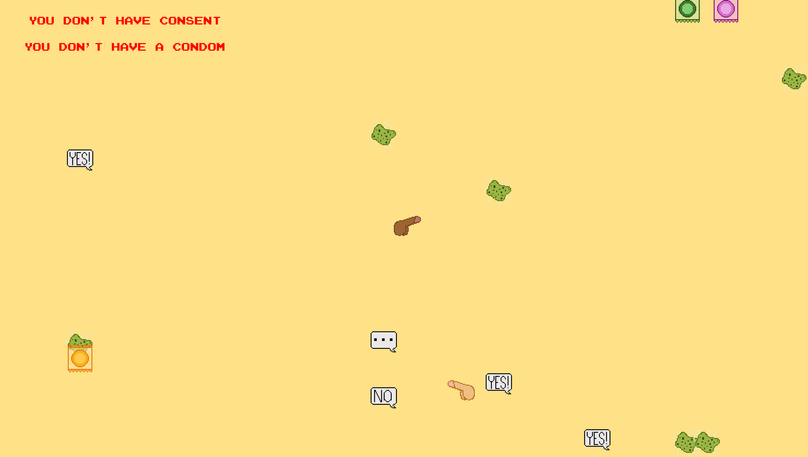
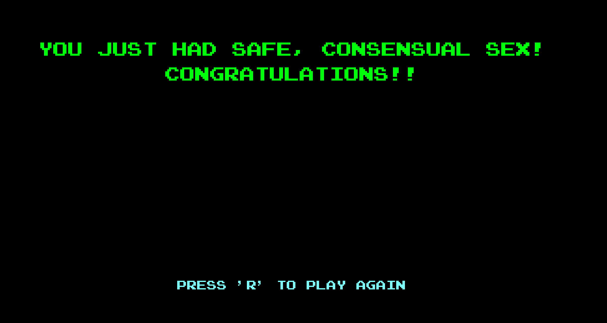

Each semester at the University of Hawaii at Manoa, a latex fair is held by the 'Bio 350: Sex Differences in the Life Cycle' class which promotes people see safe consnesual sex, when they do. The students of the class then form groups to create a game, poster or interactive project, in order to help educate others as to what safe, consensual sex entails. The projects are turned in at the fair and presented to the teacher and teaching assistants for judging. Once all of the projects have been submitted, a winning project is chosen, which for fall 2018 was my partner and I's 'Safe Sex Simulator 2018' game.

During the fall semester of 2018 I happened to be taking my first programming class ever. At the time I had just learned about loops, if statements, etc. You know, all the basics of any programming language. The Bio project was just assigned right after I finished the second project of my programming class and I had gotten an itch for creating small games with my new knowledge. Usually the projects for the fair consist of posters, altered games like cornhole but using dildos instead of beanbags, or other hands on things. Between wanting to do something with my new knowledge and not having lots of cash to purchase supplies I decided on creating a small videogame.

 

For this project I performed all of the programming in eclipse using Java, with the help of [EZ Graphics](http://www2.hawaii.edu/~dylank/ics111/) and art created by my project partner. You play the game by choosing which genital you wish to play as and then must dodge various STDs while acquiring a condom and consent before running into another gential. Each of those that you do or don't acquire before you come into contact with another genital determines what happens. For instance, not acquiring a condom beforehand might cause you to get an STD.

Our project won that year's latex fair. The teachers, TAs and other students found it to be a novelty as no other students in the past had created a video game for the fair before.

This project opened my eyes to how programming could be used in many fields in different ways. I knew at the time that I didn't make my game that complicated or use many higher level concepts, but it got me excited to learn more in order to create more sophisticated programs and applications.

You can view the code for this project on my [GitHub Repository](https://github.com/ryanell/projects/tree/master/Latexgame).
